<!-- ASCII portrait (types in, then holds) beside the neofetch info card.
     Portrait: python scripts/prep_photo.py github_profile.png && python scripts/make_ascii_svg.py
     Info card: python scripts/make_info_card.py
     Widths: 370 + 490 = 860, matching the heatmap below. -->

<h3><code>shlok@github ~ $ whoami</code></h3>

<table>
<tr>
<td valign="top"></td>
<td valign="top"></td>
</tr>
</table>

 
 

<!-- Contribution heatmap — real data, boxes reveal cell by cell.
     Regenerated daily by .github/workflows/update-profile-art.yml -->

<h3><code>shlok@github ~ $ ./contributions.sh</code></h3>

 
 

<h3><code>shlok@github ~ $ ./links.sh</code></h3>

<b>Full Stack Developer · Open Source · AI Tooling</b>

